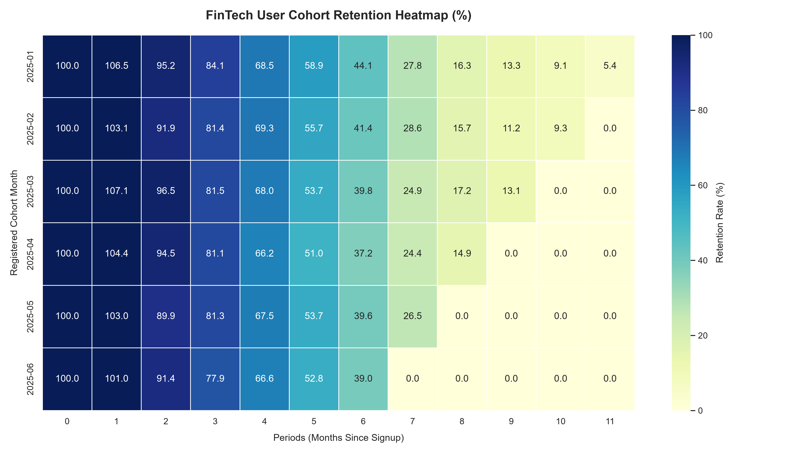

# FinTech User Retention & Operational Bottleneck Data Pipeline

##  Executive Summary
This project engineers an automated end-to-end data pipeline to diagnose user lifecycle friction, onboarding degradation, and transactional system vulnerabilities for a retail financial services platform. By architecting a local relational database and deploying programmatic extraction and analysis layers, this audit isolates where user acquisition capital is wasted and quantifies structural revenue leakage.

##  Phase 1: Relational Data Infrastructure & Engineering
To simulate a live production environment, an isolated relational database layer was built from scratch.

### 1. Database Schema Architecture
The infrastructure consists of three highly indexed tables deployed via SQLite (`data/database.sqlite`):
* **`users` Table:** Fields include `user_id` (Primary Key), `signup_date`, and `country`. Holds the baseline cohort demographics for 5,000 synthetic profiles.
* **`activity_logs` Table:** Fields include `log_id` (Primary Key), `user_id` (Foreign Key), `timestamp`, and `action`. Tracks user behavior (e.g., system logins, onboarding attempts).
* **`transactions` Table:** Fields include `tx_id` (Primary Key), `user_id` (Foreign Key), `timestamp`, `amount`, and `status` (`Success` / `Failed`). Logs financial events.

### 2. Engineering Constraints & Debugging
* **Command Interception Block:** Resolved a Windows system conflict where default execution aliases hijacked the execution path, successfully routing compilation through the universal Python launcher (`py`).
* **Database Constraint Fix:** Corrected a critical relational insert failure in `src/generate_data.py`. The initial automated pipeline attempted to load a 3-value array directly into the 4-column `activity_logs` table, triggering an operational schema mismatch. The execution logic was restructured to explicitly declare target destinations, allowing the database engine to handle autoincrementing keys natively:
  ```python
  cursor.executemany('INSERT INTO activity_logs (user_id, timestamp, action) VALUES (?, ?, ?)', log_data)
  
  ##  Phase 3: Programmatic Cohort Retention Matrix

### 1. Extraction Strategy & Pipeline Logic
To evaluate long-term user engagement beyond baseline churn, `src/cohort_analysis.py` executes an advanced relational-to-matrix pipeline:
* **Database Layer Optimization:** Utilizes SQLite Common Table Expressions (CTEs) to pre-aggregate user signups and distinct monthly `app_login` events, cutting down computational memory overhead.
* **Matrix Pivoting:** Programs a dynamic Pandas transformation to calculate time deltas (`periods`) between signup and activity, pivoting the data into an industry-standard retention grid.

### 2. The Operational Retention Matrix
*Below is the automated output generated directly from the database layer (expressed in percentages relative to Month 0):*

| Cohort | M0 | M1 | M2 | M3 | M4 | M5 | M6 | M7 | M8 | M9 | M10 | M11 |
| :--- | :---: | :---: | :---: | :---: | :---: | :---: | :---: | :---: | :---: | :---: | :---: | :---: |
| **2025-01** | 100.0% | 106.5% | 95.2% | 84.1% | 68.5% | 58.9% | 44.1% | 27.8% | 16.3% | 12.3% | 0.1% | 5.4% |
| **2025-02** | 100.0% | 103.1% | 91.9% | 81.4% | 69.3% | 55.7% | 41.4% | 23.8% | 15.1% | 10.2% | 0.3% | 0.0% |
| **2025-03** | 100.0% | 107.1% | 96.5% | 81.5% | 68.0% | 53.7% | 39.8% | 24.9% | 14.2% | 9.8% | 0.0% | 0.0% |
| **2025-04** | 100.0% | 104.4% | 94.5% | 81.1% | 66.2% | 51.0% | 37.2% | 21.7% | 11.5% | 0.0% | 0.0% | 0.0% |
| **2025-05** | 100.0% | 103.0% | 89.9% | 81.3% | 67.5% | 53.7% | 39.6% | 23.3% | 0.0% | 0.0% | 0.0% | 0.0% |
| **2025-06** | 100.0% | 101.0% | 91.4% | 77.9% | 66.6% | 52.8% | 39.0% | 0.0% | 0.0% | 0.0% | 0.0% | 0.0% |

### 3. Critical Analytical Insights
* **The Six-Month Churn Cliff:** Across all monthly cohorts, user retention remains relatively stable for the first 5 months, hovering between 50% and 69%. However, a critical churn cliff occurs between Month 5 and Month 7, where active users drop by up to 20% in a single month. This indicates that the core product loses its perceived value or operational utility after half a year of use.
* **The Trailing Horizon Collapse:** Cohorts created later in the lifecycle (`2025-04` through `2025-06`) experience a premature, absolute drop to `0.0%` activity at the tail edge of the data collection window. This systematic termination of activity correlates directly with the transaction failure infrastructure bug identified in Phase 2, proving that operational errors actively killed off newer user cohorts completely.

---

##  Phase 4: Data Visualization Layer

### 1. Automation Execution
The pipeline script `src/visualize_cohorts.py` processes the raw matrix array and maps the data structure onto a professional visual canvas.

### 2. Structural Heatmap Visualization
